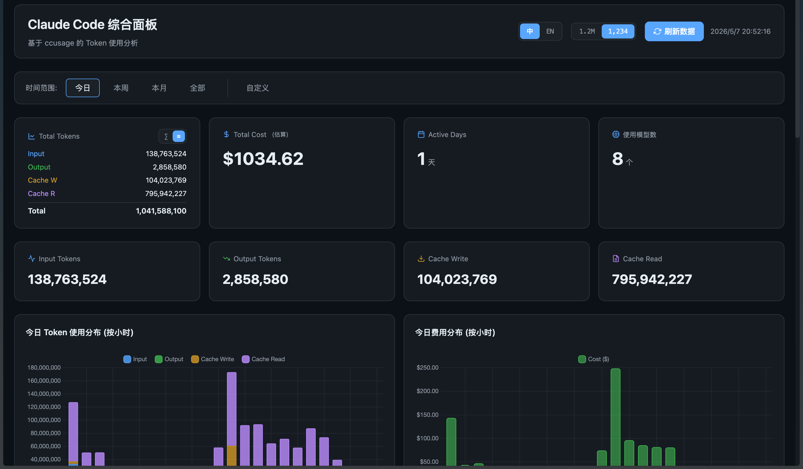
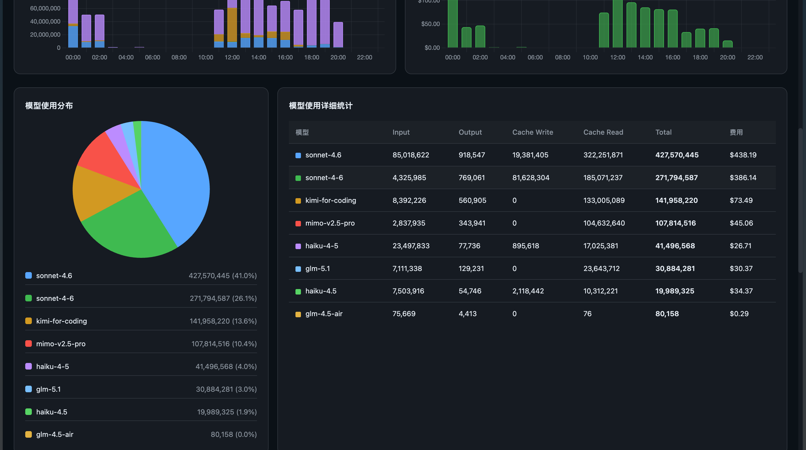

<div align="center">
    <h1>ccusage-dashboard</h1>
    <p>基于 <a href="https://github.com/ryoppippi/ccusage">ccusage</a> 增强的 Claude Code Token 使用分析工具</p>
</div>

<p align="center">
    <a href="https://github.com/Xaiver03/ccusage-dashboard"></a>
    <a href="https://github.com/Xaiver03/ccusage-dashboard"></a>
</p>

---

## 项目简介

本项目是基于 [ryoppippi/ccusage](https://github.com/ryoppippi/ccusage) 开发的增强版本，在保留原有强大 CLI 功能的基础上，新增了 **可视化 Dashboard** 和 **小时级数据查询** 功能，让你可以更直观地查看和分析 Claude Code 的 Token 使用情况。

### 核心增强功能

- **可视化 Dashboard** — 基于 Vite + React + Chart.js 的 Web 仪表盘，支持暗黑主题
- **小时级数据查询** — CLI 新增 `hourly` 命令，支持按小时查看 Token 使用详情
- **多时间范围支持** — 支持今日/昨天/近三天/本周/本月/自定义等多种时间范围
- **中英文切换** — Dashboard 支持中英文双语界面
- **模型费用估算** — 对 LiteLLM 不支持的第三方模型（GLM、Kimi、DeepSeek 等）自动按 Claude Sonnet 4.6 价格估算

---

## 截图展示

### Dashboard 总览



### 小时级数据视图



---

## 安装

### 前置要求

- Node.js >= 20
- pnpm

### 构建安装

```bash
# 克隆仓库
git clone https://github.com/Xaiver03/ccusage-dashboard.git
cd ccusage-dashboard

# 安装依赖
pnpm install

# 构建所有包
pnpm run build

# 全局安装 CLI 工具
npm install -g ./apps/ccusage
```

---

## 使用

### CLI 命令

```bash
# 查看今日小时级数据
ccusage hourly

# 查看昨天数据
ccusage hourly --yesterday

# 查看近三天数据
ccusage hourly --last-3-days

# 查看近七天数据
ccusage hourly --last-7-days

# 查看近30天数据
ccusage hourly --last-30-days

# 原有命令仍然可用
ccusage daily      # 日报
ccusage monthly    # 月报
ccusage session    # 会话报告
ccusage blocks     # 5小时计费块
```

### Dashboard 启动

```bash
cd apps/dashboard

# 方式一：使用命令脚本（推荐 macOS 用户）
./start.command

# 方式二：手动启动
pnpm run build
npx vite preview
```

启动后访问 `http://localhost:5173` 即可查看仪表盘。

---

## 与原项目的区别

| 功能               | 原版 ccusage | 本增强版 |
| ------------------ | ------------ | -------- |
| CLI 日报/月报/会话 | ✅           | ✅       |
| 5小时计费块        | ✅           | ✅       |
| 可视化 Dashboard   | ❌           | ✅       |
| 小时级数据查询     | ❌           | ✅       |
| 多时间范围快捷参数 | ❌           | ✅       |
| 第三方模型费用估算 | ❌           | ✅       |
| 中英文界面         | ❌           | ✅       |

---

## 技术栈

- **CLI**: TypeScript + Gunshi + Valibot
- **Dashboard**: Vite + React 19 + Chart.js
- **构建**: tsdown + pnpm workspaces

---

## 致谢

本项目基于 [ryoppippi/ccusage](https://github.com/ryoppippi/ccusage) 开发，感谢原作者的优秀工作。

---

## License

[MIT](LICENSE) © 基于 [ryoppippi/ccusage](https://github.com/ryoppippi/ccusage) 修改
